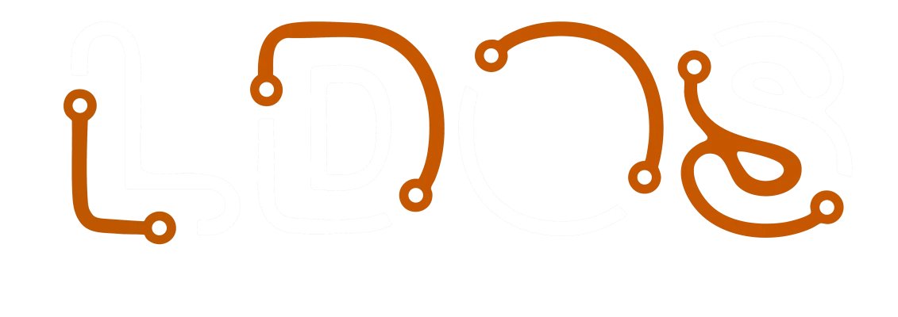

<div style="text-align: center;">

</div>

[The Learning-Directed OS project](https://ldos.utexas.edu/) is developing the next-generation Machine Learning-based
Operating System to drive computing infrastructure toward high efficiency and performance (see https://ldos.utexas.edu/
for more information). 

The project is developing a kernel based on [the Asterinas framekernel](https://asterinas.github.io). We are not
affiliated with the original authors of Asterinas and we expect our work to diverge from theirs due to very different
research goals. However, the original authors deserve a huge amount of credit for developing such an impressive system.
Our work would not be possible without their generosity in making Asterinas freely available.

Please do not report issues to the original Asterinas team or ask them questions about this repository. They are not
responsible for any of the work done in this repository.

## Introducing Asterinas


Asterinas is a _secure_, _fast_, and _general-purpose_ OS kernel
that provides _Linux-compatible_ ABI.
It can serve as a seamless replacement for Linux
while enhancing _memory safety_ and _developer friendliness_.

* Asterinas prioritizes memory safety
by employing Rust as its sole programming language
and limiting the use of _unsafe Rust_
to a clearly defined and minimal Trusted Computing Base (TCB).
This innovative approach,
known as [the framekernel architecture](https://asterinas.github.io/book/kernel/the-framekernel-architecture.html),
establishes Asterinas as a more secure and dependable kernel option.

* Asterinas surpasses Linux in terms of developer friendliness.
It empowers kernel developers to
(1) utilize the more productive Rust programming language,
(2) leverage a purpose-built toolkit called [OSDK](https://asterinas.github.io/book/osdk/guide/index.html) to streamline their workflows,
and (3) choose between releasing their kernel modules as open source
or keeping them proprietary,
thanks to the flexibility offered by [MPL](#License).

While the journey towards a production-grade OS kernel is challenging,
we are steadfastly progressing towards this goal.
Over the course of 2024,
we significantly enhanced Asterinas's maturity,
as detailed in [our end-year report](https://asterinas.github.io/2025/01/20/asterinas-in-2024.html).
In 2025, our primary goal is to make Asterinas production-ready on x86-64 virtual machines
and attract real users!

## Getting Started

Get yourself an x86-64 Linux machine with Docker installed.
Follow the three simple steps below to get Asterinas up and running.

1. Download the latest source code.

```bash
git clone https://github.com/ldos-project/asterinas
cd asterinas
```

2. Run a Docker container as the development environment.

```bash
make docker
```

3. Inside the container, go to the project folder to build and run Asterinas.

```bash
make build
make run
```

If everything goes well, Asterinas is now up and running inside a VM.
If things are running slow look for `ENABLE_KVM` in the output it should be 1 to make sure KVM was actually turned on.

Developer docs for LDOS's Asterinas are the [advanced instructions](docs/src/kernel/advanced-instructions.md). They include:
- Userspace testing
- Kernelspace testing
- development environment setup (TODO see #46)
- GDB setup information

## The Book

See [The Asterinas Book](https://asterinas.github.io/book/) to learn more about the project.

## License

Asterinas's source code and documentation primarily use the 
[Mozilla Public License (MPL), Version 2.0](https://github.com/ldos-project/asterinas/blob/main/LICENSE-MPL).
Select components are under more permissive licenses,
detailed [here](https://github.com/ldos-project/asterinas/blob/main/.licenserc.yaml). For the rationales behind the choice of MPL, see [here](https://asterinas.github.io/book/index.html#licensing).
