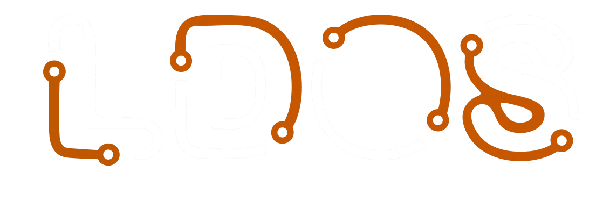

<div style="text-align: center;">

</div>

[The Learning-Directed OS project](https://ldos.utexas.edu/) is developing the next-generation Machine Learning-based
Operating System to drive computing infrastructure toward high efficiency and performance (see https://ldos.utexas.edu/
for more information). 

The project is developing a kernel based on [the Asterinas framekernel](https://asterinas.github.io). We are not
affiliated with the original authors of Asterinas and we expect our work to diverge from theirs due to very different
research goals. However, the original authors deserve a huge amount of credit for developing such an impressive system.
Our work would not be possible without their generosity in making Asterinas freely available.

Please do not report issues to the original Asterinas team or ask them questions about this repository. They are not
responsible for any of the work done in this repository.

<p align="center">
    <br>
    Toward a production-grade Linux alternative—memory safe, high-performance, and more<br/>
</p>

## Introducing Asterinas


The future of operating systems (OSes) belongs to Rust—a modern systems programming language (PL)
that delivers safety, efficiency, and productivity at once.
The open question is not _whether_ OS kernels should transition from C to Rust,
but _how_ we get there.

Linux follows an _incremental_ path.
While the Rust for Linux project has successfully integrated Rust as an official second PL,
this approach faces _inherent friction_.
As a newcomer within a massive C codebase,
Rust must often compromise on safety, efficiency, clarity, and ergonomics
to maintain compatibility with legacy structures.
And while new Rust code can improve what it touches,
it cannot retroactively eliminate _vulnerabilities_ in decades of existing C code.

Asterinas takes a _clean-slate_ approach.
By building a Linux-compatible, general-purpose OS kernel from the ground up in Rust,
we are liberated from the constraints of a legacy C codebase—its interfaces, designs, and assumptions—and from the need to preserve historical compatibility for outdated platforms.
**Languages—including PLs—shape our way of thinking**.
Through the lens of a modern PL, Asterinas rethinks and modernizes the construction of OS kernels:

* **Modern architecture.**
  Asterinas pioneers the [_framekernel_](https://asterinas.github.io/book/kernel/the-framekernel-architecture.html) architecture,
  combining monolithic-kernel performance with microkernel-inspired separation.
  Unsafe Rust is confined to a small, auditable framework called [OSTD](https://asterinas.github.io/api-docs-nightly/ostd/),
  while the rest of the kernel is written in safe Rust,
  keeping the memory-safety TCB intentionally minimal.

* **Modern design.**
  Asterinas learns from Linux's hard-won engineering lessons,
  but it is not afraid to deviate when the design warrants it.
  For example, Asterinas improves the CPU scalability of its memory management subsystem
  with a novel scheme called [CortenMM](https://dl.acm.org/doi/10.1145/3731569.3764836).

* **Modern code.**
  Asterinas's codebase prioritizes safety, clarity, and maintainability.
  Performance is pursued aggressively, but never by compromising safety guarantees.
  Readability is treated as a feature, not a luxury,
  and the codebase is structured to avoid hidden, cross-module coupling.

* **Modern tooling.**
  Asterinas ships a purpose-built toolkit, [OSDK](https://asterinas.github.io/book/osdk/guide/index.html),
  to facilitate building, running, and testing Rust kernels or kernel components.
  Powered by OSTD,
  OSDK makes kernel development as easy and fluid as writing a standard Rust application, eliminating the traditional friction of OS engineering.

Asterinas aims to become **a production-grade, memory-safe Linux alternative**,
with performance that matches Linux—and in some scenarios, exceeds it.
The project has been under active development for four years,
supports 230+ Linux system calls,
and has launched an experimental distribution,
[Asterinas NixOS](https://asterinas.github.io/book/distro/index.html).

In 2026, our priority is to advance project maturity toward production readiness,
specifically targeting standard and confidential virtual machines on x86-64.
Looking ahead, we will continue to expand functionality and 
harden the system for **mission-critical deployments**
in data centers, autonomous vehicles, and embodied AI.

## Getting Started

### Supported CPU Architectures

Asterinas targets modern, 64-bit platforms only.

A **development platform** is where you build and test Asterinas
(i.e., the host machine running the Docker-based development environment).

| Development Platform |
| -------------------- |
| x86-64               |
| ARM64                |

A **deployment platform** is a CPU architecture
that Asterinas can run on as an OS kernel.

| Deployment Platform | Tier   |
| ------------------- | ------ |
| x86-64              | Tier 1 |
| x86-64 (Intel TDX)  | Tier 2 |
| RISC-V 64           | Tier 2 |
| LoongArch 64        | Tier 3 |

Tier definitions:
- **Tier 1:** Fully supported and tested.
  CI runs the full test suite on every PR.
- **Tier 2:** Actively developed with basic functionality working.
  CI runs build checks and basic tests on a regular basis
  (per PR for RISC-V and nightly for Intel TDX),
  but the full test suite is not yet covered.
- **Tier 3:** Early-stage or experimental.
  The kernel can boot and perform basic operations,
  but CI coverage is limited and
  may not include automated runtime tests for every pull request.

### For End Users

We provide [Asterinas NixOS ISO Installer](https://github.com/ldos-project/asterinas/releases)
to make the Asterinas kernel more accessible for early adopters and enthusiasts.
We encourage you to try out Asterinas NixOS and share feedback.
Instructions on how to use the ISO installer can be found [here](https://asterinas.github.io/book/distro/index.html#end-users).

**Disclaimer: Asterinas is an independent, community-led project.
Asterinas NixOS is _not_ an official NixOS project and has _no_ affiliation with the NixOS Foundation. _No_ sponsorship or endorsement is implied.**

### For Kernel Developers

Follow the steps below to get Asterinas up and running.

1. Download the latest source code on an x86-64 (or ARM64) Linux machine:

    ```bash
    git clone https://github.com/ldos-project/asterinas
    ```

2. Run a Docker container as the development environment:

    ```bash
    make docker
    ```

    Alternatively, if you use VS Code with the
    [Dev Containers](https://marketplace.visualstudio.com/items?itemName=ms-vscode-remote.remote-containers)
    extension, open the cloned folder and select "Reopen in Container".

3. Inside the container,
go to the project folder (`/root/asterinas`) and run:

    ```bash
    make kernel
    make run_kernel
    ```

    This results in a VM running the Asterinas kernel with a small initramfs.

4. To install and test real-world applications on Asterinas,
build and run Asterinas NixOS in a VM:

    ```bash
    make nixos
    make run_nixos
    ```

    This boots into an interactive shell in Asterinas NixOS,
    where you can use Nix to install and try more packages.

### Baseline Asterinas mode

Mariposa can be compiled without ORPC support and without the LDOS features. This is used for as a
baseline for benchmarking the overhead of LDOS features.

This is controlled by the `baseline_asterinas` configuration flag. This flag is off by default.

To build in baseline mode:

```bash
make BASELINE_ASTERINAS=1 ... arguments as usual ...
```

To configure VSCode to provide IDE features based on the baseline build, see the comments in the
`editor-config/vscode/settings.json` file.

Kernel code that needs to be different in the baseline and the Mariposa kernels should use:
`#[cfg(not(baseline_asterinas))]` and `#[cfg(baseline_asterinas)]` as appropriate. The
`#[path = "..."]` attribute may also be useful, though it's use should be kept to a minimum. When it
is used the baseline variant should be named `{original}_baseline` (e.g., the `orpc` module stubs
for the baseline are in `orpc_baseline.rs`).

## Shared Configurations
Some project-related configurations have a template being maintained in this repo, named with a `.template` suffix. For example, currently the two being maintained are:
- `.vscode/settings.template.json`
- `.devcontainer/devcontainer.template.json`
Please remove the `.template` to use it as the regular configuration file. The version without the suffix is set to be untracked, so feel free to modify it as your local configuration. 

## The Book

See [The Asterinas Book](https://asterinas.github.io/book/) to learn more about the project.

## License

Asterinas's source code and documentation primarily use the 
[Mozilla Public License (MPL), Version 2.0](https://github.com/ldos-project/asterinas/blob/main/LICENSE-MPL).
Select components are under more permissive licenses,
detailed [here](https://github.com/ldos-project/asterinas/blob/main/.licenserc.yaml). For the rationales behind the choice of MPL, see [here](https://asterinas.github.io/book/index.html#licensing).
